# Aiffel hackathon

22. 8 ~ 22. 9 aiffel hackathon project

90년대부터 현재까지의 패션 월간지를 학습하여, 최신 디자인을 과거 트렌드로 재해석하는 이미지 생성 모델 설계

## Feature 종류

- 계절
- 성별, 유니섹스
- 트렌드(90년대 ~ 05년, 06년 ~ 22년)
- 악세사리

## Introduction

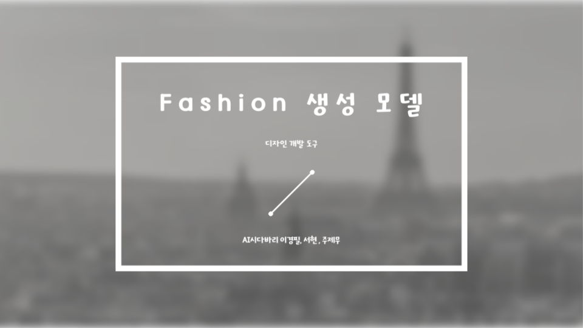
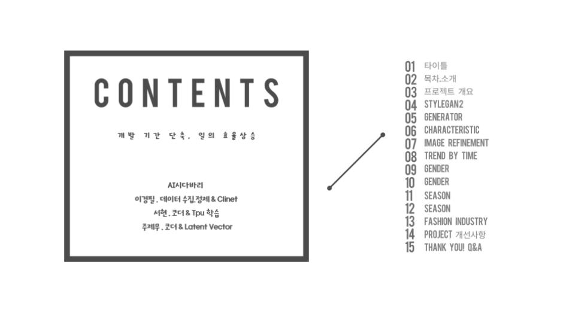
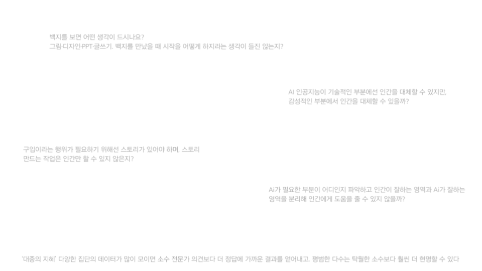
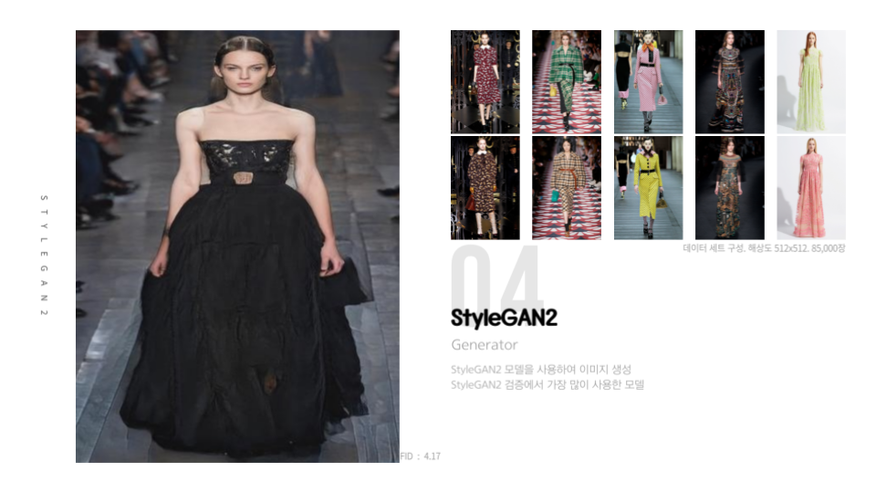
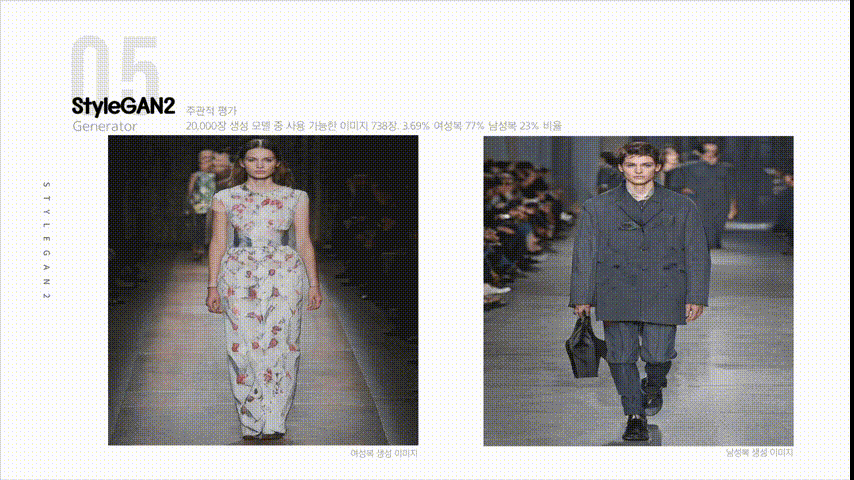
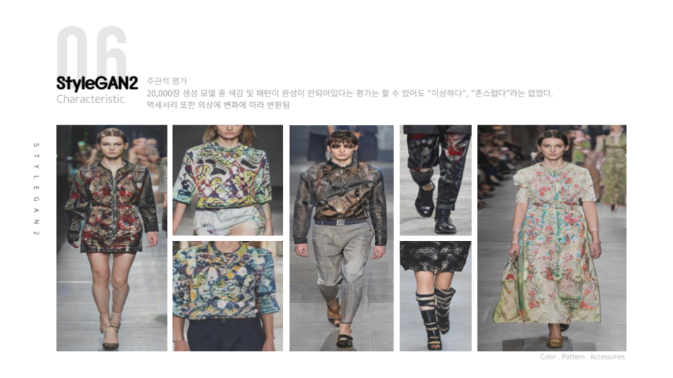
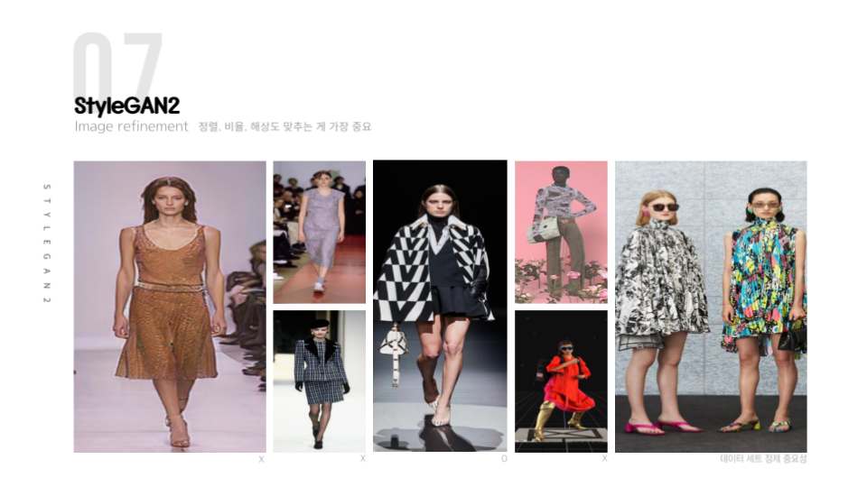

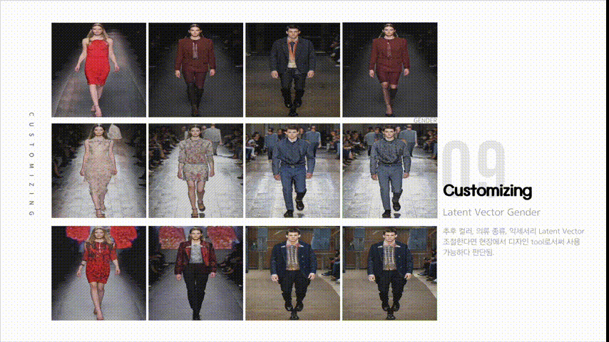
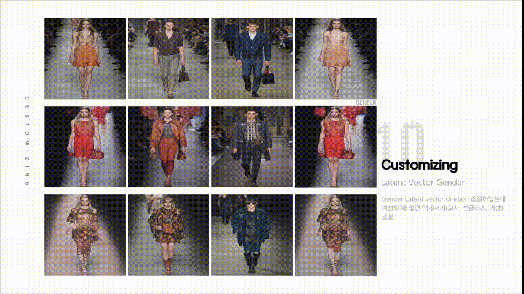
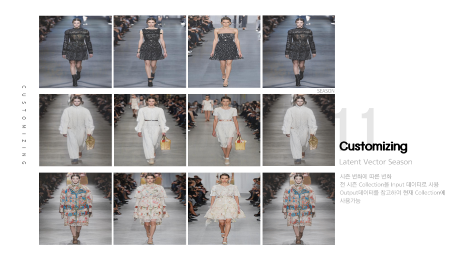
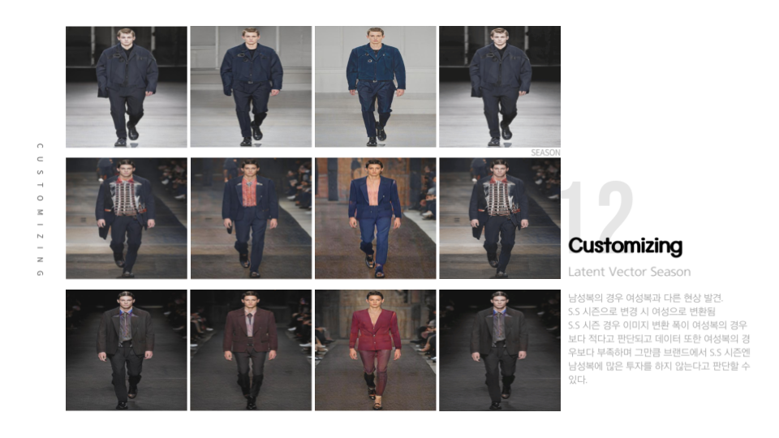
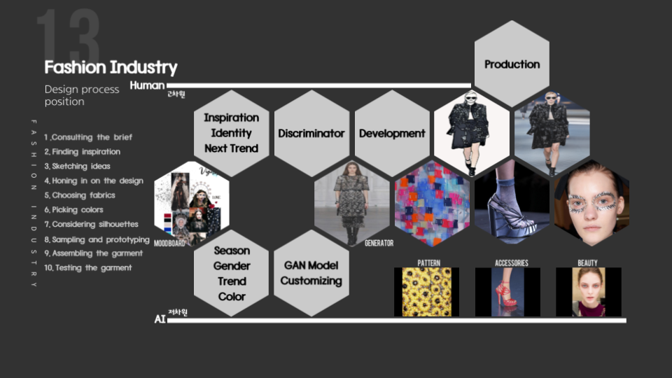
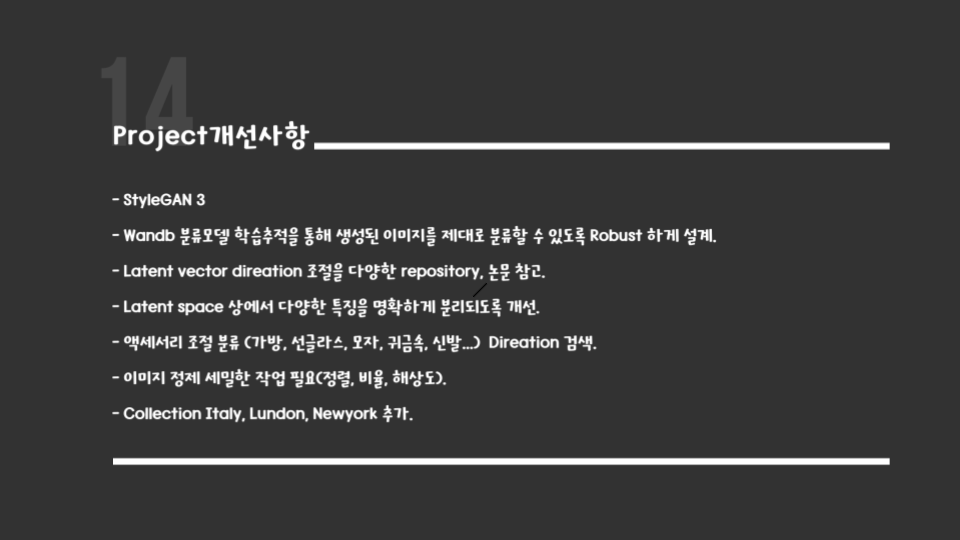
